# SupTech-XAI: Metadata-Driven Anomaly Detection Pipeline

An end-to-end, event-driven **SupTech / RegTech** data pipeline for a
central-banking context. It ingests high-frequency banking submissions,
enforces global statistical-reporting standards (**SDMX**) via a metadata
registry, classifies unstructured text at scale using local embeddings,
produces **explainable** anomaly reports with a local LLM, and closes the loop
with a **supervisory-analytics + AI-evaluation layer** (detector precision /
recall / F1, LLM faithfulness scoring, and PSI drift monitoring) — all with
**no data leaving the machine**.

> **Note:** Independent educational simulation. Uses only synthetic data and
> mock services. Not affiliated with or endorsed by any central bank or
> supervisory authority.

---

## Why this design

Two ideas drive the architecture, both drawn from how supervisory authorities
are approaching AI on large regulatory datasets:

- **Embeddings before LLMs (cost/scale).** Running an LLM over every row of a
  statistical return is slow and expensive. Instead, unstructured text is
  turned into vector **embeddings** and classified by similarity to category
  centroids. Only the small set of *outliers* is escalated to an LLM.
- **Explainability, not black boxes (governance).** When a record is flagged,
  a local model produces a **Chain-of-Thought** justification and risk rating,
  so a human supervisor gets an auditable rationale — not just a score.
- **Evaluate and monitor the AI (model risk).** The pipeline doesn't just run
  models — it *tests* them: honest precision/recall/F1 for the detector (using
  the generator's ground-truth labels), faithfulness/validity scoring plus
  LLM-as-judge for the explanations, and PSI-based drift detection to know when
  a model needs re-checking.

Everything runs **on-premises / air-gapped-friendly** (local embeddings, local
LLM via Ollama), which matches the privacy constraints of sovereign financial
data.

---

## SDMX & FMR fidelity

SDMX and FMR are the **governance backbone** of the pipeline — the AI only ever
sees data that has already passed structural validation. The mock deliberately
mirrors the real artefacts and API surface so the concepts map 1:1:

| Real SDMX / FMR concept | In this project |
|---|---|
| Agency-maintained, versioned **DSD** | `DEMO:BANKING_FLOWS(1.0)` with dimensions, `OBS_VALUE` measure, attributes, codelists (`config.py`) |
| **Dataflow** + canonical **URN** | `DEMO:BANKING_FLOWS_FLOW(1.0)` / `urn:sdmx:org.sdmx.infomodel...` |
| **SDMX-CSV** data-exchange format | `data/raw_submissions.csv` (`STRUCTURE,STRUCTURE_ID,ACTION,<components>`) |
| **SDMX-JSON** streaming observations | Kafka message payloads |
| FMR **structure** query (SDMX REST API) | `GET /ws/public/sdmxapi/rest/structure/datastructure/{agency}/{id}/{version}` |
| FMR **data-validation** web service | `POST /ws/public/data/validate` (accepts SDMX-CSV or SDMX-JSON) |
| FMR **validation report** | JSON report with `Position`-indexed errors, severity and codes |
| SDMX **series key** as observation identity | `ref_area.institution_id.asset_class.time_period` (built in wrangling) |

Structural checks enforced: mandatory dimensions, codelist membership, numeric
measure representation, `TIME_PERIOD` format, and **duplicate-observation**
detection on the series key — the same classes of checks a real FMR performs.

> The endpoint paths and report shape follow the FMR REST API documented in the
> FMR Knowledge Base; the logic and data are simulated (synthetic data only).

---

## Architecture



> Full design write-up (component-by-component, data model, sequence diagrams):
> **[`docs/ARCHITECTURE.md`](docs/ARCHITECTURE.md)**.
>
> Documentation index:
> **[`docs/README.md`](docs/README.md)**.
>
> Dataset, models, and LLM use cases (with step-by-step validation):
> **[`docs/LLM_AND_DATA.md`](docs/LLM_AND_DATA.md)**.
>
> RAG variants & multi-model exploration (supervisory / risk / treasury):
> **[`docs/RAG_AND_MODELS.md`](docs/RAG_AND_MODELS.md)**.
>
> Sample developer + analytics report (from a local demo run):
> **[`docs/sample_reports/dev_analytics_report.md`](docs/sample_reports/dev_analytics_report.md)**.
>
> Sample RAG comparison report:
> **[`docs/sample_reports/rag_comparison_report.md`](docs/sample_reports/rag_comparison_report.md)**.

<details>
<summary>ASCII fallback diagram</summary>

```
                 (SDMX-JSON submissions)
data_generator ───────────────► Kafka topic ──┐
(kafka_producer.py)                            │
                                               ▼
                       ┌──────────────────────────────────────┐
                       │ 1. Ingest & validate                  │
                       │    calls FMR mock (FastAPI) to check   │
                       │    each record against the SDMX DSD    │◄── metadata_registry
                       │    → rejects non-compliant records     │    (fmr_mock_api.py)
                       └──────────────────────────────────────┘
                                               ▼
                       ┌──────────────────────────────────────┐
                       │ 2. Wrangle with DuckDB                 │
                       │    vectorised SQL clean / flatten /    │
                       │    dedupe → Parquet                    │
                       └──────────────────────────────────────┘
                                               ▼
                       ┌──────────────────────────────────────┐
                       │ 3. Embed + classify + score           │
                       │    local embeddings → FAISS/numpy      │
                       │    nearest-centroid → anomaly score    │
                       └──────────────────────────────────────┘
                                               ▼
                       ┌──────────────────────────────────────┐
                       │ 4. Explain (XAI)                       │
                       │    LangChain + local Ollama LLM        │
                       │    Chain-of-Thought → Markdown report  │
                       │    + structured explanations.jsonl     │
                       └──────────────────────────────────────┘
                                               ▼
                       ┌──────────────────────────────────────┐
                       │ 5. Analytics & AI evaluation           │
                       │    DuckDB supervisory KPIs             │──► metrics API
                       │    detector P/R/F1 + threshold sweep   │──► HTML report
                       │    LLM faithfulness / judge + PSI drift │──► dashboard
                       └──────────────────────────────────────┘
                                               │ (optional)
                                               ▼
                       ┌──────────────────────────────────────┐
                       │ 6. RAG exploration                     │
                       │    dense/hybrid/filtered/corrective/   │
                       │    graph × llama3/mistral/qwen2.5      │──► rag comparison
                       │    supervisory · risk · treasury Q&A   │    report
                       └──────────────────────────────────────┘
```

</details>

## Technology stack

| Concern                | Tool                                                        |
|------------------------|-------------------------------------------------------------|
| Ingestion / streaming  | Apache Kafka (KRaft mode, containerised)                    |
| Metadata governance    | FastAPI mock **FMR** enforcing an **SDMX** DSD              |
| Analytical wrangling   | **DuckDB** (in-memory columnar SQL)                         |
| Bulk classification    | HuggingFace embeddings (`all-MiniLM-L6-v2`) + **FAISS**     |
| Explainable AI         | **LangChain** + local **Ollama** (e.g. Llama 3)            |
| Analytics & AI eval    | DuckDB metrics, P/R/F1 + PSI drift, FastAPI, **Streamlit** |
| RAG exploration        | Dense / hybrid / filtered / corrective / graph + Ollama matrix |
| Deployment             | Podman (rootless) + Compose, OpenShift-style; Docker-compatible |

### Runs offline by design

Every heavy/optional dependency has a transparent fallback, so the full
pipeline runs with **only the core dependencies** and **no network**:

| Optional component        | Fallback used when absent                         |
|---------------------------|---------------------------------------------------|
| Kafka                     | local newline-delimited JSON file                 |
| FMR REST API (running)    | in-process validator (identical validation logic) |
| sentence-transformers     | deterministic hashing vectoriser (numpy)          |
| FAISS                     | numpy nearest-centroid search                     |
| Ollama LLM                | rule-based Chain-of-Thought explainer             |
| Ollama (LLM-as-judge)     | deterministic rubric-based scorer                 |
| Ollama (Stage 6 RAG)      | grounded answer listing retrieved chunk IDs       |
| Streamlit dashboard       | self-contained static HTML analytics report       |

---

## Quickstart (no containers, no Kafka, no LLM needed)

```bash
make install          # create .venv and install core deps
make demo             # run stages 0–5 end-to-end on synthetic data
make rag              # Stage 6: multi-retriever × multi-model RAG comparison
# or: python run_demo.py --with-rag
```

Or manually:

```bash
python3 -m venv .venv && source .venv/bin/activate
pip install -r requirements.txt          # core deps are uncommented by default
python run_demo.py --count 500
python -m rag.run_rag                    # optional Stage 6
```

Example output:

```
=== Stage 1: ingest & FMR validation ===
[ingest] processed=500 accepted=434 rejected=66
=== Stage 2: DuckDB wrangling ===
[wrangle] cleaned rows=434
=== Stage 3: embed, classify & score anomalies ===
[embed] threshold=0.9693 flagged=29
=== Stage 4: Chain-of-Thought explanations ===
[explain] wrote 29 explanations -> data/reports/anomaly_report.md
=== Stage 5: analytics & AI evaluation ===
[analytics] detector P/R/F1 = 1.0/1.0/1.0 | LLM validity=1.0 faithfulness=1.0 judge=5.0
=== Stage 6: RAG & multi-model exploration ===
[rag] hit@k=0.91 recall@k=0.91 citation=0.75 faithfulness=0.88
```

Outputs land in `data/`: the compliance report (`reports/anomaly_report.md`),
the analytics report (`reports/analytics_report.html`), the developer report
(`reports/dev_analytics_report.md`), the RAG comparison report
(`reports/rag_comparison_report.md`), and machine-readable metrics
(`metrics.json`, `rag_results.json`).

Documentation index: **[`docs/README.md`](docs/README.md)**.

## Running the stages individually

```bash
python data_generator/kafka_producer.py --local --count 500
python pipeline/1_ingest_validate.py
python pipeline/2_wrangle_duckdb.py
python pipeline/3_embed_classify.py
python pipeline/4_explain_anomaly.py
python analytics/run_analytics.py     # stage 5
python -m rag.run_rag                 # stage 6 (optional)
```

## Enabling the "real infrastructure" path

```bash
# 1. Start Kafka + the FMR mock (requires Podman; rootless works)
make infra-up
#   equivalent to: podman compose up -d --build
#   (falls back to `podman-compose up -d --build` on older Podman)
#   to use Docker instead:  make infra-up CONTAINER_ENGINE=docker

# 2. Publish submissions to the Kafka topic instead of a file
python data_generator/kafka_producer.py --count 5000

# 3. Consume from Kafka; validation now goes over the FMR REST API
python pipeline/1_ingest_validate.py --source kafka

# When finished:
make infra-down
```

With the FMR mock running you can hit the real endpoints directly:

```bash
# SDMX REST structure query
curl localhost:8000/ws/public/sdmxapi/rest/structure/datastructure/DEMO/BANKING_FLOWS/1.0

# FMR data-validation web service (POST an SDMX-CSV dataset)
curl -X POST localhost:8000/ws/public/data/validate \
     -H 'Content-Type: text/csv' --data-binary @data/raw_submissions.csv
```

For real embeddings and LLM explanations, uncomment the optional blocks in
`requirements.txt`, `pip install` them, and (for XAI) run a local model:

```bash
ollama pull llama3        # https://ollama.com
```

---

## Deploy on OpenShift

The repo ships OpenShift-native manifests in [`openshift/`](openshift/) — an
`ImageStream` + `BuildConfig`, `Deployment`/`Service`/`Route` for the FMR mock,
metrics API and Streamlit dashboard, an ephemeral Kafka, and a `CronJob` that
runs the pipeline each reporting cycle. A single image serves every component
(role selected by the container command), and everything is **restricted-SCC
compatible** (arbitrary non-root UID, dropped capabilities, seccomp).

```bash
oc new-project suptech-xai
make oc-build      # ImageStream + BuildConfig, then binary build from local source
make oc-deploy     # oc apply -k openshift/
oc get route dashboard metrics-api fmr
```

Full details, production notes (Strimzi, RWX storage, GPU Ollama) and teardown:
**[`openshift/README.md`](openshift/README.md)**.

---

## Analytics & AI evaluation (Stage 5)

The analytics layer turns pipeline output into supervisory KPIs and a rigorous
**test/evaluation + monitoring** suite for the AI components.

**What it measures**

- **Supervisory analytics** — anomaly rate and flagged value-at-risk by
  jurisdiction, asset class and institution; FMR rejection-rate KPI; anomalies
  over time.
- **Detector evaluation** — precision / recall / F1 / confusion matrix against
  the generator's ground-truth labels, plus a **threshold sweep** that finds the
  F1-optimal `ANOMALY_SIGMA`.
- **LLM explanation evaluation** — *output validity* (parseable risk rating),
  *faithfulness recall* (does the explanation cite the red-flag terms actually
  present?), and an optional **LLM-as-judge** score (1–5) with a deterministic
  fallback so it runs offline and in CI.
- **Drift monitoring** — Population Stability Index (PSI) on category and
  anomaly-score distributions, with `stable / moderate / major` bands.

**How to use it**

```bash
python analytics/run_analytics.py     # writes data/metrics.json + HTML report
make api                              # metrics REST API on :8001
#   GET /metrics/summary  /metrics/evaluation  /metrics/drift  /metrics/all
pip install streamlit && make dashboard   # interactive dashboard
open data/reports/analytics_report.html   # self-contained static report
open data/reports/dev_analytics_report.md # developer + analytics markdown report
```

> On the bundled synthetic data the seeded anomalies are cleanly separable, so
> the detector and rule-based explainer score near-perfect — the point is that
> the *harness* proves it. Swapping in the real `all-MiniLM-L6-v2` embeddings
> and an Ollama LLM produces more nuanced sub-1.0 faithfulness / judge scores.

---

## RAG exploration (Stage 6)

Stage 6 compares **five RAG retrievers** and **three local LLM tags** on
synthetic questions for **supervisory analysis**, **risk narratives**, and
**treasury / liquidity** Q&A. Answers must cite retrieved chunk IDs.

| Retrievers | `dense` · `hybrid` · `filtered` · `corrective` · `graph` |
|---|---|
| Models | `llama3` · `mistral` · `qwen2.5` (via Ollama, with offline fallback) |
| Metrics | Hit@k, recall@k, citation rate, term coverage, faithfulness proxy |

```bash
make rag
# writes data/rag_results.json + data/reports/rag_comparison_report.md
```

Full write-up: **[`docs/RAG_AND_MODELS.md`](docs/RAG_AND_MODELS.md)**.  
Sample report: **[`docs/sample_reports/rag_comparison_report.md`](docs/sample_reports/rag_comparison_report.md)**.

---

## Repository layout

```
suptech-xai-pipeline/
├── config.py                     # shared config, SDMX DSD, codelists, thresholds
├── compose.yaml                  # Kafka (KRaft) + FMR mock (Podman/Docker Compose)
├── run_demo.py                   # end-to-end local orchestrator
├── data_generator/
│   └── kafka_producer.py         # synthetic SDMX submissions (Kafka or JSONL)
├── Containerfile                 # unified app image (FMR / API / dashboard / pipeline)
├── metadata_registry/
│   ├── fmr_mock_api.py           # FastAPI FMR mock (SDMX REST + data validation)
│   ├── validator.py              # DSD validation → FMR-style report
│   └── sdmx_csv.py               # SDMX-CSV reader/writer
├── pipeline/
│   ├── 1_ingest_validate.py      # consume + FMR structural validation
│   ├── 2_wrangle_duckdb.py       # DuckDB cleaning / flattening
│   ├── 3_embed_classify.py       # embeddings + FAISS/numpy classification + scoring
│   ├── 4_explain_anomaly.py      # LangChain + Ollama Chain-of-Thought XAI
│   └── embeddings.py             # embedding backends (model + offline fallback)
├── analytics/                    # Stage 5 — analytics & AI evaluation
│   ├── supervisory.py            # DuckDB supervisory KPIs
│   ├── evaluation.py             # P/R/F1, CoT step checks, faithfulness, judge
│   ├── cot_steps.py              # shared STEP1..STEP4 parse + validate helpers
│   ├── drift.py                  # PSI drift monitoring
│   ├── report.py                 # self-contained static HTML report
│   ├── dev_report.py             # developer + analytics markdown report
│   ├── metrics_api.py            # FastAPI /metrics/* endpoints
│   └── run_analytics.py          # stage-5 orchestrator
├── dashboard/
│   └── app.py                    # Streamlit analytics dashboard
├── docs/
│   ├── README.md                 # documentation index
│   ├── ARCHITECTURE.md           # full design write-up
│   ├── LLM_AND_DATA.md           # dataset, models, LLM use cases & validation
│   ├── RAG_AND_MODELS.md         # RAG variants & multi-model exploration
│   ├── sample_reports/           # checked-in demo report snapshots
│   ├── diagrams/                 # mermaid sources (*.mmd)
│   └── images/                   # rendered SVG diagrams
├── rag/                          # Stage 6 — RAG exploration
│   ├── corpus/                   # synthetic supervisory/risk/treasury docs
│   ├── load_corpus.py            # front-matter corpus loader
│   ├── index.py                  # embeddings + BM25 index
│   ├── llm.py                    # Ollama / offline grounded answers
│   ├── retrievers/               # dense, hybrid, filtered, corrective, graph
│   ├── pipelines/                # question cases for three tracks
│   ├── evaluate_rag.py           # hit@k, citation, faithfulness proxy
│   ├── run_rag.py                # multi-retriever × multi-model runner
│   └── report.py                 # RAG comparison markdown report
└── openshift/                    # OpenShift manifests (ImageStream, BuildConfig,
                                  # Deployments, Services, Routes, CronJob, kustomize)
```

---

## License

MIT — see `LICENSE`. Synthetic data only; educational simulation.
