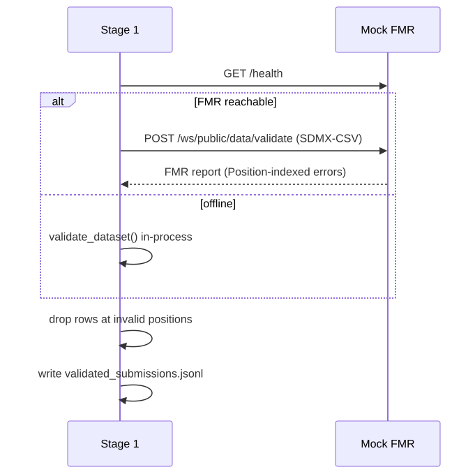

# SupTech-XAI — Architecture & Design

> Educational simulation. Synthetic data only. Not affiliated with or endorsed
> by any central bank or supervisory authority.

## 1. What the project is

**SupTech-XAI** simulates a central bank's **supervisory data pipeline**.
Commercial banks submit high-frequency statistical returns; the system validates
them against the international **SDMX** standard via a **Fusion Metadata Registry
(FMR)**, cleans them, uses **local AI** to classify and flag suspicious activity,
produces **explainable** justifications for human supervisors, computes
**analytics + AI-evaluation metrics** (model quality and drift), and explores
**RAG + multi-model LLMs** for supervisory, risk, and treasury Q&A. Everything
runs **on-premises / air-gapped** — no data or API calls leave the machine.

## 2. Design philosophy

| Principle | What it means | Why it matters |
|---|---|---|
| **Governance first** | Data must pass SDMX/FMR validation *before* any AI touches it | Regulators never analyse non-compliant data |
| **Embeddings before LLMs** | Bulk classification via vector similarity; LLM only for flagged outliers | LLM-per-row does not scale in cost or latency |
| **Explainable, not black-box** | Every flag gets a Chain-of-Thought rationale + risk rating | Supervisory decisions must be auditable |
| **Evaluate & monitor the AI** | The pipeline tests its own models (P/R/F1, faithfulness, PSI drift) | Model-risk management |
| **Ground LLMs in documents (RAG)** | Multi-retriever × multi-model Q&A over synthetic policy/risk/treasury briefs | Auditable citations for analysis narratives |
| **On-prem & offline-capable** | Local embeddings, local LLM, and a fallback for every dependency | Sovereign data cannot go to cloud APIs |

## 3. High-level architecture


The **governance boundary** is the key architectural line: Stage 1 + the FMR sit
between the outside world and the analytics core. Nothing crosses into Stages 2–5
unless it is structurally valid SDMX. Stage 6 (RAG) is an **adjacent exploration
layer** over a synthetic document corpus — it does not bypass FMR validation.

## 4. Data flow (artifacts between stages)



| Stage | Reads | Writes | Engine |
|---|---|---|---|
| 0 Generate | — | `raw_submissions.csv` | Python + SDMX-CSV |
| 1 Ingest/validate | raw CSV | `validated_submissions.jsonl` | FMR REST / in-process |
| 2 Wrangle | validated | `wrangled.parquet` | DuckDB |
| 3 Classify | parquet | `classified.jsonl` | embeddings + FAISS/numpy |
| 4 Explain | classified | `explanations.jsonl`, `anomaly_report.md` | LangChain + Ollama |
| 5 Analytics | classified + explanations | `metrics.json`, HTML + MD reports | DuckDB + numpy |
| 6 RAG (optional) | `rag/corpus/*.md` | `rag_results.json`, `rag_comparison_report.md` | retrievers + Ollama |

## 5. Data model (SDMX DSD)

Defined in `config.py` — a fictional banking-flows dataflow:

- **Dimensions** (identify an observation): `REF_AREA`, `INSTITUTION_ID`, `ASSET_CLASS`, `TIME_PERIOD`
- **Measure**: `OBS_VALUE`
- **Attributes**: `CURRENCY`, `TXN_PURPOSE` (free text — analysed by the AI)
- **Codelists** constrain coded fields (e.g. `REF_AREA ∈ {US, GB, DE, JP, CH, SG, FR, IN}`)
- **Identity**: agency `DEMO`, DSD `BANKING_FLOWS(1.0)`, Dataflow `BANKING_FLOWS_FLOW(1.0)`, each with a canonical SDMX **URN**

The **observation identity** is the SDMX **series key**:
`ref_area.institution_id.asset_class.time_period` — also the basis for duplicate
detection.

## 6. Component design

### Stage 0 — Data generator (`data_generator/kafka_producer.py`)
Simulates banks submitting returns and deliberately seeds two problem classes:
- **Structural violations** (~12%): bad codes, missing dimensions, non-numeric
  measures → exercise the FMR.
- **Semantic anomalies** (~6%): suspicious `TXN_PURPOSE` + extreme amounts →
  exercise the AI.

Because the generator *knows* which records are anomalous, it yields
**ground-truth labels for free** — the foundation of the evaluation layer.

### The FMR (`metadata_registry/`)
- `sdmx_csv.py` — reads/writes the real SDMX-CSV format.
- `validator.py` — checks mandatory dimensions, codelist membership, numeric
  measure, `TIME_PERIOD` format, and **duplicate observations** on the series
  key. `validate_dataset()` returns an **FMR-style report** with `Position`-
  indexed errors, severity, and error codes.
- `fmr_mock_api.py` — FastAPI service exposing the **real FMR endpoints**:
  SDMX-REST structure query, `POST /ws/public/data/validate`, product info.

The validation logic lives in `validator.py` (importable) and is *wrapped* by the
HTTP API, so Stage 1 behaves identically whether it calls the FMR over HTTP or
falls back in-process — one source of truth.

### Stage 1 — Ingest & validate (`pipeline/1_ingest_validate.py`)



Enforces the governance boundary. Rejected records never proceed.

### Stage 2 — Wrangle (`pipeline/2_wrangle_duckdb.py`)
DuckDB vectorised SQL: trims/normalises fields, casts `OBS_VALUE`, dedupes,
constructs the **SDMX series-key id**, isolates `TXN_PURPOSE`, and writes columnar
**Parquet**. In-process analytical engine — fast, zero-server.

### Stage 3 — Embed & classify (`pipeline/3_embed_classify.py`, `embeddings.py`)
1. Embed each `TXN_PURPOSE` with a local model (`all-MiniLM-L6-v2`) or a
   deterministic hashing vectoriser fallback.
2. Build one **centroid per asset class** from labelled seed phrases.
3. Assign each record to its nearest centroid (FAISS or numpy).
4. **Anomaly score = distance to nearest centroid**; flag records beyond
   `mean + σ·std`.

No LLM here — vector similarity scales; only flagged records escalate.

### Stage 4 — Explain / XAI (`pipeline/4_explain_anomaly.py`)
A strict **Chain-of-Thought** prompt drives a local Ollama LLM (rule-based
fallback) to reason step-by-step and emit a **risk rating** + recommended action.
Writes a human-readable `anomaly_report.md` and a structured `explanations.jsonl`.

### Stage 5 — Analytics & AI evaluation (`analytics/`)
- `supervisory.py` — KPIs (anomaly rate & flagged value by jurisdiction / asset
  class / institution, FMR rejection rate).
- `evaluation.py` — detector **precision/recall/F1 + confusion matrix** vs ground
  truth, a **threshold sweep** to auto-tune σ, **per-step CoT validation**, and
  **LLM evaluation** (output validity, faithfulness recall, LLM-as-judge).
- `drift.py` — **PSI** drift monitoring with stable/moderate/major bands.
- `report.py`, `dev_report.py`, `metrics_api.py`, `run_analytics.py`,
  `dashboard/app.py` — static HTML report, developer markdown report, REST
  metrics API, and Streamlit dashboard.

### Stage 6 — RAG exploration (`rag/`)
Compares **five retrievers** (dense, hybrid, filtered, corrective, graph) and
**three local LLM tags** (`llama3`, `mistral`, `qwen2.5`) across **three
question tracks** (supervisory, risk narrative, treasury/liquidity).

- Corpus: synthetic markdown briefs with SDMX-aligned metadata (`rag/corpus/`).
- Evaluation: hit@k, recall@k, citation rate, term coverage, faithfulness proxy.
- Outputs: `data/rag_results.json`, `data/reports/rag_comparison_report.md`.
- Run: `make rag` or `python run_demo.py --with-rag`.

Full detail: [`RAG_AND_MODELS.md`](RAG_AND_MODELS.md).

## 7. Runs offline by design

| Optional dependency | Fallback |
|---|---|
| Kafka | local SDMX-CSV file |
| FMR HTTP server | in-process validator (same logic) |
| sentence-transformers | hashing vectoriser (numpy) |
| FAISS | numpy nearest-centroid |
| Ollama LLM (Stage 4) | rule-based Chain-of-Thought |
| Ollama judge | deterministic rubric scorer |
| Ollama (Stage 6 RAG) | grounded answer listing retrieved chunk IDs |
| Streamlit | static HTML report |

## 8. Deployment design

`compose.yaml` starts **Kafka in KRaft mode** (Zookeeper-less) and the
containerised FMR. Defaults to **Podman** (rootless, daemonless — mirrors
OpenShift/CRI-O), and stays Docker-compatible via `make infra-up CONTAINER_ENGINE=docker`.

## 9. Limitations (by design)

- On synthetic data the seeded anomalies are cleanly separable, so scores read
  near-perfect — the *harness* is the point; real MiniLM + Llama 3 give more
  nuanced numbers.
- Single-machine batch/micro-batch simulation, not a distributed streaming
  deployment.
- The DSD is intentionally small and readable, not a full real-world SDMX schema.
- Data and agency identifiers are simulated and clearly disclaimed.
- The RAG corpus is a small synthetic set for comparing retrievers — not a
  production knowledge base.

For dataset shape, model defaults, and the LLM validation loop, see
[`LLM_AND_DATA.md`](LLM_AND_DATA.md). For RAG variants and the multi-model
matrix, see [`RAG_AND_MODELS.md`](RAG_AND_MODELS.md). Docs index:
[`README.md`](README.md).

---

### Regenerating the diagrams

Diagram sources live in `docs/diagrams/*.mmd`. To re-render the SVGs (via
[Kroki](https://kroki.io)):

```bash
for d in architecture dataflow fmr-validation; do
  curl -s -X POST https://kroki.io/mermaid/svg \
       --data-binary @docs/diagrams/$d.mmd -o docs/images/$d.svg
done
```
