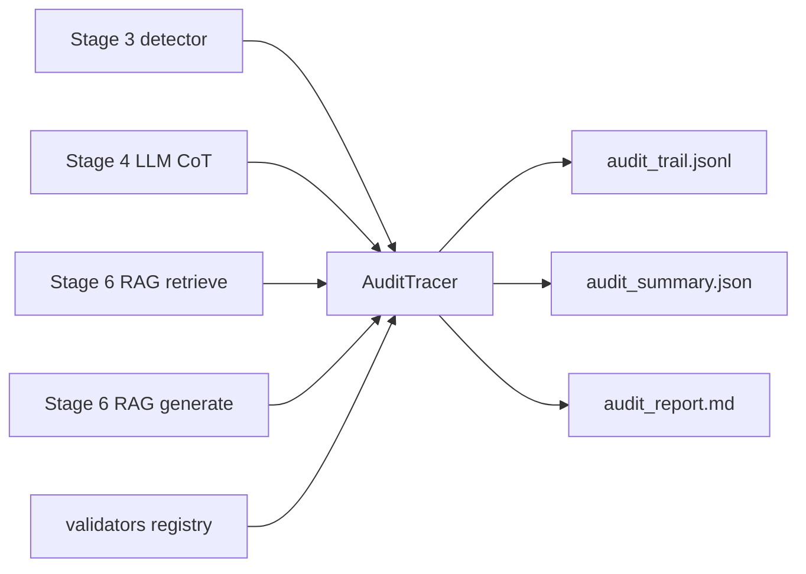

# Explainability, validation & audit trail

This document describes the **cross-cutting audit layer**: how every detector,
LLM Chain-of-Thought, and RAG retrieve/generate step can be **explained**,
**validated**, and **reviewed** — and how to extend that for future use cases.

Synthetic data only. Educational simulation — not affiliated with or endorsed
by any central bank or supervisory authority.

Related: [`LLM_AND_DATA.md`](LLM_AND_DATA.md) · [`RAG_AND_MODELS.md`](RAG_AND_MODELS.md) ·
[`ARCHITECTURE.md`](ARCHITECTURE.md)

---

## 1. Why a shared audit layer

| Need | Without audit | With audit |
|---|---|---|
| Explain AI at each step | Scattered logs / free text | Structured `reasoning_steps[]` |
| Validate LLM / RAG outputs | Ad-hoc scripts | Named `ValidationCheck`s with pass/fail |
| Independent review | Re-run models | Replay `audit_trail.jsonl` |
| Future pipelines | Copy-paste | Register a validator + emit events |

Stages 3–6 already produce artefacts; the audit layer **normalises** them into
one schema so supervisors and engineers share the same evidence pack.



---

## 2. Audit event schema (v1.0)

Each event (`AuditEvent`) includes:

| Field | Meaning |
|---|---|
| `pipeline` | `detector` · `llm_xai` · `rag` · (future keys) |
| `stage` / `step_name` | Where in the flow |
| `subject_id` | Observation id or `case:retriever:model` |
| `model` / `engine` / `prompt_version` | What produced the output |
| `inputs` / `outputs` | Compact evidence payload |
| `reasoning_steps[]` | Human-readable step-by-step explanation |
| `validations[]` | Named checks with `passed`, `severity`, optional `score` |
| `status` | `ok` / `failed` (failed if any error-severity check fails) |

Schema lives in `audit/schema.py` and is versioned (`schema_version`).

---

## 3. What is validated today

### Detector (Stage 3)
- Anomaly score present  
- Predicted category present  

### LLM XAI (Stage 4)
Per CoT contract (`STEP1`…`STEP4`):
- All steps present  
- Purpose/asset, amount, red flags, rating+action checks  
- Parseable `LOW` / `MEDIUM` / `HIGH` rating  

### RAG retrieve (Stage 6)
- Non-empty retrieval  
- Hit@k vs gold chunk ids (when labelled)  

### RAG generate (Stage 6)
- Non-empty answer  
- At least one citation to retrieved ids  
- Domain term coverage (warn)  
- Faithfulness proxy gate (≥ 0.5)  

---

## 4. How to run

```bash
# After demo / rag artefacts exist:
make audit
# or
python -m audit.run_audit

# Full path including RAG then audit:
python run_demo.py --with-rag --with-audit
```

### Outputs

| Artefact | Path |
|---|---|
| Event trail | `data/audit_trail.jsonl` |
| Summary | `data/audit_summary.json` |
| Markdown report | `data/reports/audit_report.md` |
| Sample (tracked) | `docs/sample_reports/audit_report.md` |

---

## 5. Extending for future use cases

The registry pattern keeps the store/report stable:

1. **Write a validator** in `audit/validators.py`:

```python
def validate_my_pipeline(payload: dict):
    reasoning = [ReasoningStep(...)]
    validations = [ValidationCheck(check_id="...", name="...", passed=...)]
    return reasoning, validations

VALIDATORS["my_pipeline"] = validate_my_pipeline
```

2. **Emit events** (live) via `AuditTracer.step(...)`, or batch-build from
   artefacts in `audit/build.py`.

3. **Re-run** `python -m audit.run_audit` — summary/report pick up the new
   `pipeline` key automatically.

Suggested future pipelines that fit the same mould:

| Future use case | Pipeline key | Typical checks |
|---|---|---|
| Policy Q&A over new manuals | `rag_policy` | citation, jurisdiction filter |
| Liquidity stress narrative | `treasury_stress` | numeric grounding, period cited |
| Multi-agent review loop | `agent_review` | tool-call trace + final citation |
| Prompt A/B regression | `llm_xai` | same CoT checks + judge delta |

---

## 6. Map to code

| Piece | Path |
|---|---|
| Schema | `audit/schema.py` |
| Tracer | `audit/tracer.py` |
| Validators registry | `audit/validators.py` |
| Build from artefacts | `audit/build.py` |
| Report | `audit/report.py` |
| CLI | `audit/run_audit.py` |
| Config paths | `config.py` (`AUDIT_*`) |

---

## 7. Design principles (keep these)

1. **Explain every AI step** — reasoning_steps are mandatory for LLM/RAG.  
2. **Validate before trusting** — error-severity failures flip `status=failed`.  
3. **Offline capable** — audit runs on artefacts; no live LLM required.  
4. **Stable schema** — bump `schema_version` only on breaking changes.  
5. **No sensitive branding** in events or docs — generic supervisory framing.
