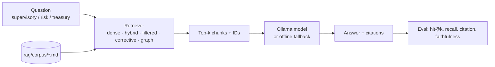

# RAG variants & LLM models for financial analytics

This document describes **Stage 6** of the project: exploring
**retrieval-augmented generation (RAG)** patterns and **local LLMs** for
supervisory analysis, risk narratives, and treasury / liquidity Q&A.

Synthetic corpus and questions only. Educational simulation — not affiliated
with or endorsed by any central bank or supervisory authority.

Related docs: [`ARCHITECTURE.md`](ARCHITECTURE.md) · [`LLM_AND_DATA.md`](LLM_AND_DATA.md) ·
[sample comparison report](sample_reports/rag_comparison_report.md)

---

## 1. Why RAG here

| Stages 1–5 answer | Stage 6 answers |
|---|---|
| *What* is structurally invalid or semantically anomalous? | *Why it matters*, grounded in written guidance |
| Detector score + CoT risk rating on a single row | Multi-doc retrieval + cited narrative across policy / risk / treasury briefs |

RAG keeps LLM answers **auditable**: every response should cite chunk IDs from
the synthetic corpus (e.g. `[POL-AML-001]`).

Design constraints:

- On-prem friendly (local embeddings + optional Ollama)
- Offline fallbacks (hashing embedder + rule-based answers)
- No external vector DB required (numpy + in-repo markdown)
- No institution-specific branding in corpus or docs



---

## 2. Corpus

Nine markdown documents under `rag/corpus/` with YAML-like front matter:

| Field | Purpose |
|---|---|
| `id` | Stable chunk ID used in citations and gold labels |
| `track` | `supervisory` · `risk` · `treasury` |
| `topics` | Free tags (e.g. `psi`, `sanctions`, `liquidity`) |
| `asset_classes` | SDMX-aligned filter values |
| `jurisdictions` | SDMX-aligned filter values |

| Track | Document IDs | Themes |
|---|---|---|
| Supervisory | `POL-AML-001`, `POL-SAN-002`, `POL-SDMX-003` | Structuring/layering, sanctions/shell, SDMX-before-AI |
| Risk | `RISK-CONC-010`, `RISK-PRED-011`, `RISK-TRADE-012` | Concentration/PSI, score *drivers*, trade mis-invoicing |
| Treasury | `TRY-LIQ-020`, `TRY-FX-021`, `TRY-RATE-022` | Liquidity/roll risk, FX mismatch, rate-sensitive flows |

**Risk prediction** in this project means **driver explanation** of elevated
embedding-based scores — not a black-box market forecast.

---

## 3. Retrievers compared

| Retriever | Algorithm | Why it matters for financial text |
|---|---|---|
| **dense** | Cosine similarity over embeddings | Baseline semantic retrieval |
| **hybrid** | Dense + BM25 fused with **RRF** | Exact tokens (PSI, typology words, codes) |
| **filtered** | Dense pool → filter by asset / jurisdiction / track | Mirrors SDMX dimension constraints |
| **corrective** | Hybrid → coverage check → expanded re-query | Recovers when first pass misses typology terms |
| **graph** | Topic/asset/jurisdiction graph neighbourhood + dense re-rank | Linked-entity style reasoning over metadata |

Configured with `RAG_RETRIEVERS` (default: all five).

---

## 4. LLMs compared

Default matrix (`RAG_MODELS`):

| Model tag | Role in the matrix |
|---|---|
| `llama3` | Primary on-prem explainer (also used in Stage 4 XAI) |
| `mistral` | Alternate instruction-tuned local model |
| `qwen2.5` | Third local option for sensitivity / variance checks |

Behaviour:

1. Prefer **Ollama** at `OLLAMA_BASE_URL` with the selected model tag.
2. If Ollama is missing or errors, use a **deterministic grounded fallback**
   that still lists retrieved chunk IDs — so `make rag` works offline and in CI.

Embeddings: HuggingFace `all-MiniLM-L6-v2` when installed; otherwise the same
hashing vectoriser used in Stage 3.

---

## 5. Question tracks (9 gold-labelled cases)

Defined in `rag/pipelines/__init__.py` (`CASES`).

| Track | Example question themes | Gold chunk examples |
|---|---|---|
| **Supervisory** | Structuring below thresholds; sanctioned intermediaries; why FMR before AI | `POL-AML-001`, `POL-SAN-002`, `POL-SDMX-003` |
| **Risk** | PSI/concentration narrative; embedding score drivers; trade mis-invoicing | `RISK-CONC-010`, `RISK-PRED-011`, `RISK-TRADE-012` |
| **Treasury** | Roll risk & buffers; FX routine vs exception; IRS/bond vs crime language | `TRY-LIQ-020`, `TRY-FX-021`, `TRY-RATE-022` |

Each case also carries `must_terms` (domain words that should appear in a good
answer) and optional SDMX-like filters (`asset_class`, `jurisdiction`).

Full factorial run (default):

\[
9\ \text{cases} \times 5\ \text{retrievers} \times 3\ \text{models} = 135\ \text{scored runs}
\]

---

## 6. Metrics

| Metric | Meaning |
|---|---|
| **Hit@k** | ≥1 gold chunk appears in the top-k retrieved set |
| **Recall@k** | Fraction of gold chunks retrieved |
| **Citation rate** | Fraction of retrieved IDs mentioned in the answer text |
| **Term coverage** | Fraction of required domain terms present in the answer |
| **Faithfulness proxy** | `0.5·hit + 0.3·citation + 0.2·term_coverage` |

The comparison report rolls these up **overall**, **by retriever**, **by model**,
and **by track**, and lists strongest / weakest sample runs.

---

## 7. How to run

```bash
# Stage 6 only
make rag
python -m rag.run_rag

# Full pipeline (0–5) plus Stage 6
python run_demo.py --with-rag
```

### Outputs

| Artefact | Path |
|---|---|
| Machine-readable results | `data/rag_results.json` |
| Comparison report | `data/reports/rag_comparison_report.md` |
| Cached embeddings index | `data/rag_index/` (gitignored) |
| Sample snapshot (tracked) | `docs/sample_reports/rag_comparison_report.md` |

### Environment knobs

```bash
export RAG_MODELS=llama3,mistral,qwen2.5
export RAG_RETRIEVERS=dense,hybrid,filtered,corrective,graph
export RAG_TOP_K=4
export OLLAMA_BASE_URL=http://localhost:11434
```

Optional: pull models for live LLM answers

```bash
ollama pull llama3
ollama pull mistral
ollama pull qwen2.5
```

---

## 8. Interpreting a sample run

A typical offline run (hashing embedder + rule-based answers) looks like:

| Overall | Approx. value |
|---|---|
| Hit@k | ~0.9 |
| Citation rate | ~0.75 |
| Faithfulness proxy | ~0.85–0.90 |

With real MiniLM + Ollama, expect more variance across models and richer prose;
retrieval metrics (hit/recall) should stay in a similar band if the corpus and
gold labels are unchanged.

Use **by-retriever** rows in the report to see whether hybrid/filtered/graph
beat dense on typology-heavy questions, and **by-track** rows to see if treasury
vs supervisory questions need different retrievers.

---

## 9. Map to code

| Piece | Path |
|---|---|
| Corpus | `rag/corpus/*.md` |
| Front-matter loader | `rag/load_corpus.py` |
| Index + BM25 | `rag/index.py` |
| Retrievers | `rag/retrievers/__init__.py` |
| Cases / runners | `rag/pipelines/__init__.py` |
| LLM + fallback | `rag/llm.py` |
| Eval metrics | `rag/evaluate_rag.py` |
| Orchestrator | `rag/run_rag.py` |
| Report writer | `rag/report.py` |
| Config | `config.py` (`RAG_*` settings) |

---

## 10. What Stage 6 is *not*

- Not a production document store or enterprise search platform
- Not live market data or confidential filings
- Not a claim of production risk-model accuracy
- Not a substitute for human supervisory judgment
