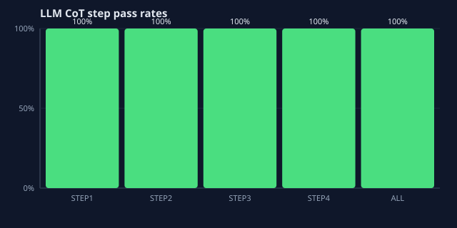
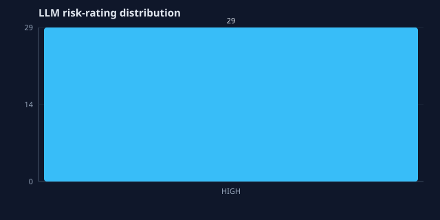
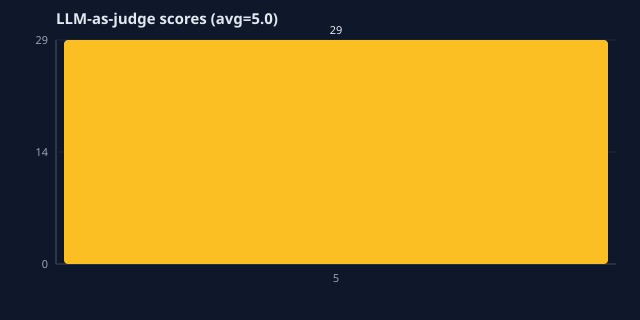
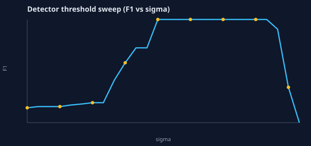
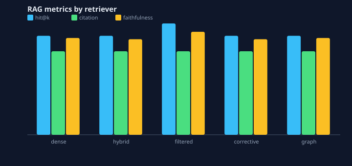
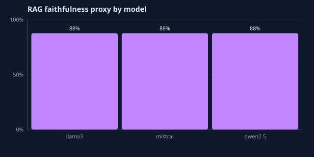
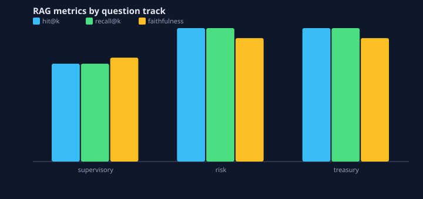
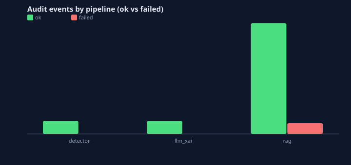

# Chart gallery — LLM, RAG & audit

Auto-generated SVG charts from a local pipeline run. Reviewers can view these on GitHub without starting Streamlit.

## Llm Step Pass Rates

## Llm Risk Rating Distribution

## Llm Judge Score Distribution

## Detector Threshold F1

## Rag By Retriever

## Rag Faithfulness By Model

## Rag By Track

## Audit By Pipeline

